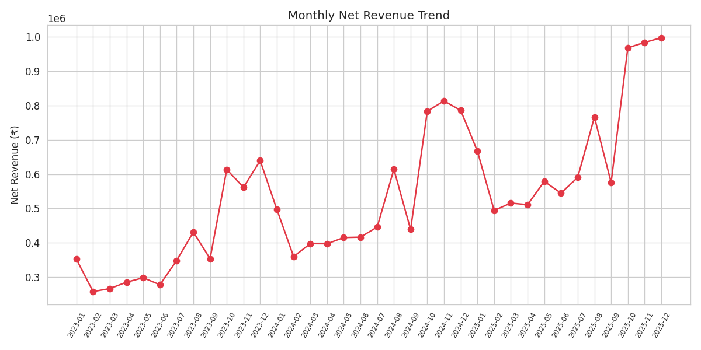
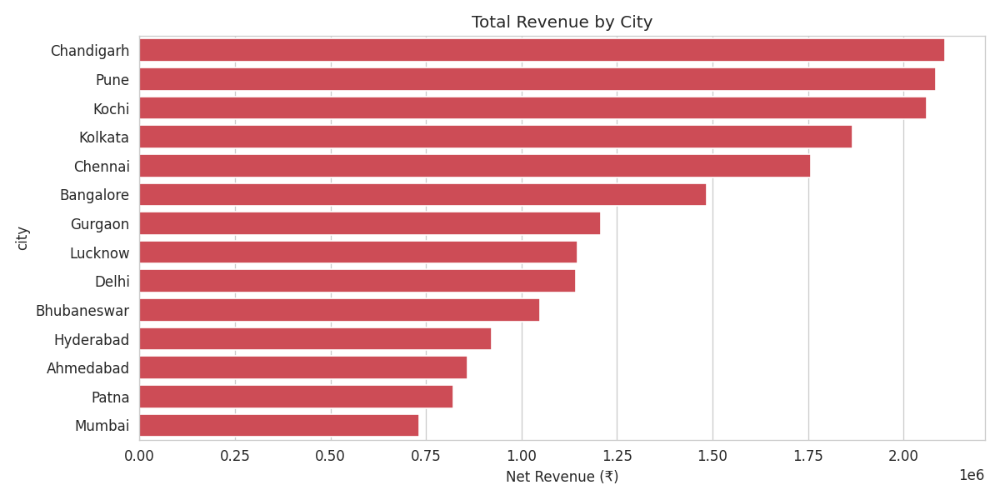
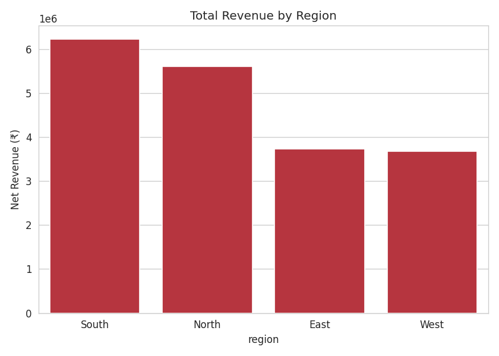
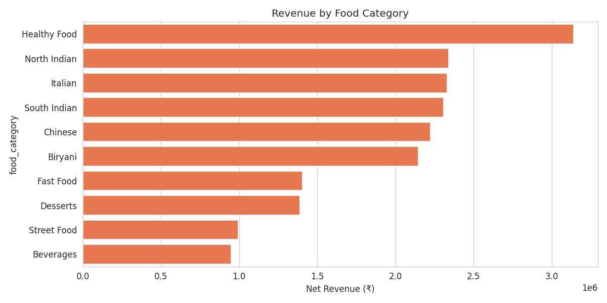
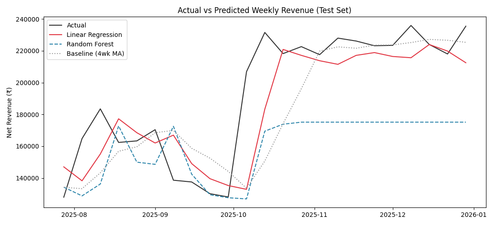
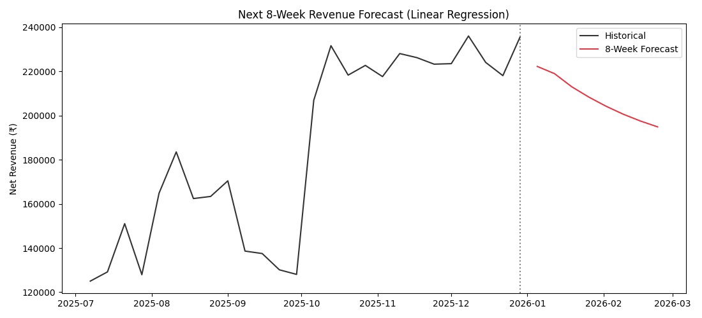

# Zomato Sales Analytics & Future Prediction

End-to-end data analytics project: cleaning, exploratory analysis, SQL querying,
Power BI dashboarding, and machine-learning-based revenue forecasting on a
Zomato-style food delivery sales dataset.

## Objective
Analyze food delivery sales performance across cities, regions, and food
categories to surface revenue trends and customer behavior, then forecast
near-term revenue to support business planning (staffing, inventory, promos).

## Dataset
- **Source**: Synthetically generated to mirror real Zomato order data
  (`notebooks/01_generate_data.py`), since no official public dataset was
  available. Deliberately includes realistic messiness — duplicates, mixed
  date formats, missing values, inconsistent casing — to demonstrate cleaning.
- **Size**: 45,000 orders across 3 years (Jan 2023 – Dec 2025)
- **Columns**: order id/date, restaurant, city, region, food category,
  quantity, order value, discount %, delivery fee, payment mode, rating,
  delivery time, new/returning customer flag

## Approach

### 1. Data Cleaning (`notebooks/01_data_cleaning.py`)
- Removed duplicate orders (by `order_id`)
- Standardized text fields (casing, whitespace) for city/category/payment/restaurant
- Parsed two mixed date formats into a single `datetime` type
- Imputed missing `rating` (category-level median), `delivery_fee` (0 = free-delivery
  promo assumption), `payment_mode` (mode)
- Capped `order_value` outliers at the 1st/99th percentile instead of dropping rows
- Engineered `net_revenue`, `month`, `year`, `weekday`, `is_weekend`

### 2. Exploratory Data Analysis (`notebooks/02_eda.py`)
Generates 7 charts into `visuals/`: monthly revenue trend, revenue by city/region/category,
order value distribution, weekday order volume, discount vs. order count.

**Key insights:**
- Total net revenue: ~₹1.92 crore across 45,000 orders (avg order value ₹318)
- South region leads revenue (~₹62L), followed by North (~₹56L)
- Healthy Food, North Indian, and Italian are the top 3 categories by revenue
- Weekend orders make up ~38% of revenue despite being 2/7 of days — clear weekend demand spike
- Revenue nearly doubled from 2023 (₹47L) to 2025 (₹82L), consistent steady growth

### 3. SQL Analysis (`sql/queries.sql`)
10 queries covering top cities, month-over-month growth (`LAG`), category performance,
new vs. returning customers, running revenue totals, city-wise top category (`RANK`),
weekend vs weekday behavior, discount impact, payment mode by region, and a
data-quality flag query (low-rated but high-volume restaurants). All validated
against a SQLite load of the cleaned dataset.

### 4. Power BI Dashboard (`powerbi/`)
`zomato_sales_data_for_powerbi.xlsx` is ready to import. See `POWERBI_GUIDE.md`
for the full build steps: star-schema modeling, DAX measures (Total Revenue,
YoY Growth %, Avg Order Value, Weekend Revenue %), and 5 suggested dashboard pages.

### 5. Predictive Analytics (`notebooks/03_prediction_model.py`)
- Aggregated to **weekly** revenue (daily data was too sparse/noisy for a stable signal)
- Compared 3 approaches on a holdout test set:
  - Baseline: 4-week trailing moving average
  - **Linear Regression** (trend + lag features) — **beats baseline MAE by ~17%**
  - Random Forest — underperforms here, because tree models can't extrapolate a
    trend beyond the range seen in training; on a steadily growing series, the
    linear trend term wins. (Included deliberately as a discussion point on model choice.)
- Forecasts the next 8 weeks of revenue using the winning Linear Regression model
  → saved to `data/processed/revenue_forecast_next_8_weeks.csv`

## Key Insights Summary
- ~₹1.92 Cr total net revenue, ~45,000 orders, ₹318 average order value
- South region and Chandigarh/Pune/Kochi are the top revenue drivers
- Weekend demand is disproportionately high (38% of revenue on 2/7 of the week)
- Revenue has grown steadily (~75% over 3 years) — Linear Regression forecasting
  captures this trend more reliably than tree-based models on this data

## Tech Stack
Python (pandas, numpy, matplotlib, seaborn, scikit-learn, statsmodels) · SQL (SQLite) · Power BI · openpyxl

## Project Structure
```
zomato-sales-analytics/
├── data/
│   ├── raw/                          # original messy dataset
│   └── processed/                    # cleaned dataset, SQLite db, forecast output
├── notebooks/
│   ├── 01_generate_data.py           # synthetic data generator
│   ├── 01_data_cleaning.py
│   ├── 02_eda.py
│   └── 03_prediction_model.py
├── sql/
│   └── queries.sql
├── powerbi/
│   ├── zomato_sales_data_for_powerbi.xlsx
│   └── POWERBI_GUIDE.md
├── visuals/                          # exported chart PNGs
├── requirements.txt
└── README.md
```

## How to Run
```bash
pip install -r requirements.txt
cd notebooks
python 01_generate_data.py     # generates data/raw/zomato_sales_raw.csv
python 01_data_cleaning.py     # generates data/processed/zomato_sales_cleaned.csv
python 02_eda.py               # generates charts in visuals/
python 03_prediction_model.py  # trains models, generates forecast + charts
```
For SQL: load `data/processed/zomato_sales_cleaned.csv` into any SQL engine
(SQLite/PostgreSQL/MySQL) as table `orders`, then run `sql/queries.sql`.

For Power BI: open Power BI Desktop and follow `powerbi/POWERBI_GUIDE.md`.

## Project Output

<table>
<tr>
<td align="center">
<b>Monthly Revenue Trend</b><br>

</td>

<td align="center">
<b>Revenue by City</b><br>

</td>
</tr>

<tr>
<td align="center">
<b>Revenue by Region</b><br>

</td>

<td align="center">
<b>Revenue by Food Category</b><br>

</td>
</tr>

<tr>
<td align="center">
<b>Actual vs Predicted Revenue</b><br>

</td>

<td align="center">
<b>8-Week Revenue Forecast</b><br>

</td>
</tr>
</table>
---

---

<div align="center">

## 👩‍💻 Developed by Akhila Palagani

**B.Tech Computer Science & Engineering Student**
**Aspiring Data Analyst | Data Engineer | Software Developer**

This project demonstrates an end-to-end data analytics workflow, covering data preprocessing, exploratory data analysis, SQL-based business insights, interactive Power BI dashboards, and machine learning for revenue forecasting. It reflects my passion for solving real-world business problems using data and modern analytics technologies.

<p>
  <a href="https://github.com/Akhila-Palagani24">GitHub</a> •
  <a href="https://www.linkedin.com/in/akhila-palagani-52b749321/">LinkedIn</a>
</p>

⭐ If you found this project useful, consider giving it a star!

</div>
